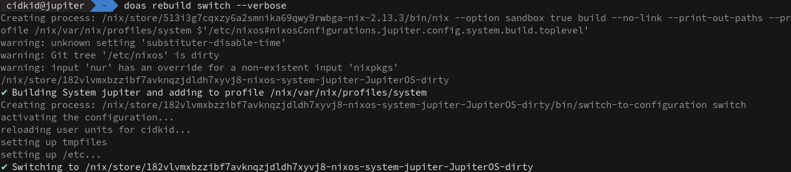

<h1 align="center">rebuild</h1>

<h5 align="center">Re-implementation of nixos-rebuild and darwin-rebuild in haskell</h1>

<h2 align="left">Currently Supports</h1>

- Flakes
- nixos-rebuild commands (switch|build|vm|vm-with-bootloader|dry-activate)
- Quick Command to build isoImages
- Installing NixOS
- Deploying to remote machine accessable via SSH, with root user access
- Nix-Darwin (switch), no support for activate-user yet
- Easy garbage collection of system(s)

<h2 align="left">TODO</h1>

- Specialisations
- Flush out deployment more
- Remove ugly CPP hacks
